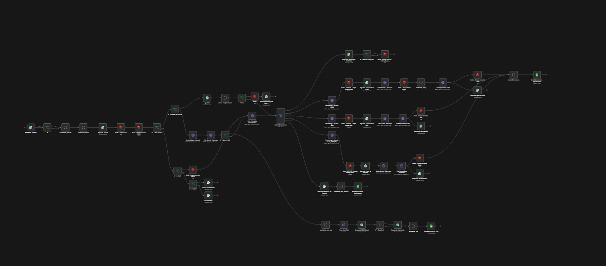
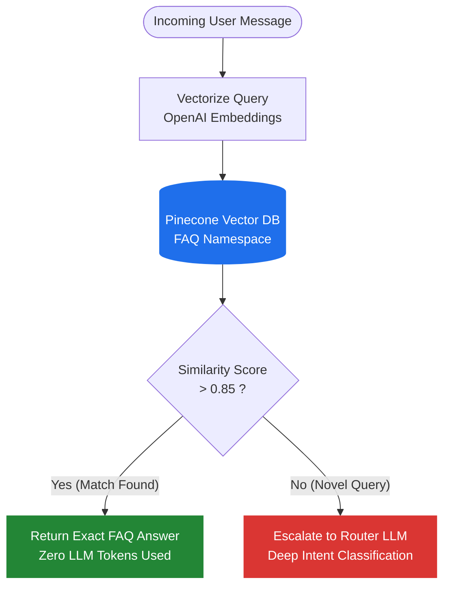
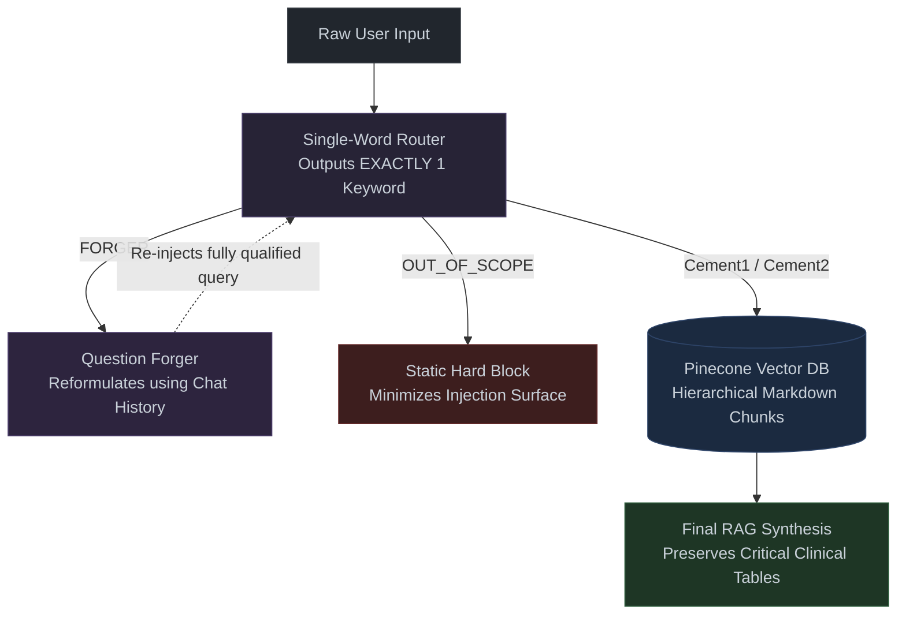

# 🦷 Clinical Support-Chatbot: RAG Multi-Level Assistant

> A WhatsApp chatbot for dental clinical support, built on a multi-level Retrieval-Augmented Generation (RAG) architecture explicitly designed to **eliminate hallucinations in healthcare contexts**.

*Note: Client details are omitted per confidentiality agreement. Architecture and engineering decisions are documented here for portfolio purposes.*

---

## 📑 Table of Contents
- [Architecture Overview](#%EF%B8%8F-architecture-overview)
- [The 4-Stage Decision Pipeline](#-the-4-stage-decision-pipeline)
- [Deep Dive: Engineering Decisions](#-deep-dive-engineering-decisions)
- [Tech Stack](#-tech-stack)

---

## 🏗️ Architecture Overview

<!-- Coloque uma screenshot bonita do n8n ou diagrama aqui -->

  
   
  <em>n8n Workflow</em>

The system orchestrates a 4-stage decision pipeline that physically isolates decision logic from text generation logic. The LLM acts **only as a reader and formatter**, never as an ungrounded knowledge source.

---

## 🛤️ The 4-Stage Decision Pipeline

### 1. LGPD Validation (Gatekeeper)
State control is managed via **Google Sheets** and **Redis**. Every incoming user ID is intercepted and checked for Terms-of-Use acceptance before any AI processing begins. Unregistered users are securely locked in a consent flow.

  
   
  <em>WhatsApp Demo - LGPD</em>

### 2. Tier 1: Hot Search (Vectorized FAQ)
Semantic retrieval using Pinecone + Redis + OpenAI Embeddings. Queries are vectorized and matched against a pre-approved FAQ knowledge base. 
*If the similarity score exceeds a strict threshold, the answer is served instantly, bypassing the LLM entirely.*

### 3. Tier 2: Router LLM (The "AI Trench")
When the Hot Search score is low, `gpt-4o-mini` operates strictly as a classifier. It reads the incoming message and routes it to exactly one predefined segment:
- 📖 **Clinical Manual:** Routes to curated technical protocols.
- 💬 **FAQ:** Routes to hand-crafted answers for recurring questions.
- 🛠️ **Question Forger:** If the query is ambiguous or incomplete, this trench reconstructs it into a well-formed query before re-injecting it into the pipeline—improving retrieval precision natively.
- 🛑 **OUT_OF_SCOPE:** Triggers a hard block with a fixed response.

### 4. Tier 3: Specialist RAG
Based on the router's decision, the flow queries isolated **Pinecone namespaces per product line**. Each namespace contains curated clinical documentation scoped strictly to its product.

---

## 🧠 Deep Dive: Engineering Decisions

To dig deeper into the technical choices that make this architecture robust, scalable, and safe for healthcare, explore the toggles below.

<b>📉 FAQ Vector Strategy & Cost Optimization</b> (Click to expand)

 
In conversational AI, passing every single message through an LLM is highly inefficient. 

- **Cost & Latency:** By intercepting common queries with the Tier 1 Hot Search, we return answers instantly and bypass LLM prompt/completion costs.
- **Data Ingestion:** The FAQ dataset is maintained externally by the domain expert (client) via Google Sheets, empowering non-technical users to manage Q&A pairs. An automated workflow syncs these into Pinecone.
- **Threshold Tuning:** A strict threshold prevents false positives. If the query falls below the mathematical threshold it is escalated to the Router LLM.

<b>✍️ Prompt Engineering & Structuring Notes</b> (Click to expand)

 

- **The Single-Word Router:** Traditional LLMs are verbose. The Router prompt is strictly constrained to output *only a single predefined keyword* (e.g., `Cemente1`, `Cement2`, `OUT_OF_SCOPE`). This eliminates parsing errors and ensures the Switch Node executes exact string matching.
- **Contextual Query Reconstruction:** The "Question Forger" intercepts fragmented follow-up questions and reformulates them against the chat history before vector retrieval, drastically improving semantic search accuracy.
- **Hierarchical Markdown Ingestion:** Clinical documentation was curated manually and structured in Markdown to preserve semantic boundaries (Headers, bullet points). The text splitter respects these boundaries, ensuring critical decision tables and protocols are retrieved as complete, unaltered units (preventing the LLM from summarizing or omitting key clinical data).
- **Injection Surface Minimization:** Out-of-scope queries trigger a hard block. Since the LLM never processes unclassified input directly, the prompt injection surface is drastically minimized.

---

## 💻 Tech Stack
- **Orchestration:** n8n
- **State & Caching:** Redis
- **Vector Database:** Pinecone
- **AI Models:** OpenAI (`gpt-4o-mini` + `text-embedding-3-small`)
- **Messaging:** WhatsApp API
- **Data Management:** Google Sheets
